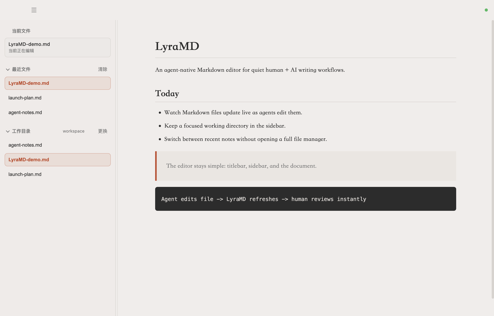

# LyraMD

**Lyra's agent-native Markdown editor.**

Real-time collaboration between humans and AI agents, adapted for a quieter workflow around Markdown files, selected-text AI help, recent documents, and a lightweight working directory sidebar.

[](LICENSE)
[](https://github.com/Afeng01/LyraMD/releases)
[](https://github.com/Afeng01/LyraMD/releases)

[Download](#download) | [Why LyraMD](#why-this-fork) | [Features](#features) | [Development](#development) | [中文](README_CN.md)



## Features

- **Live file refresh**: when an AI agent edits the current Markdown file, LyraMD reloads it automatically.
- **Agent change summary** for external edits, with compact preview, burst coalescing, and one-click rollback.
- **AI Genie command palette** for selected text, with editable prompt templates, model status, preview, replace, insert, and copy actions.
- **OpenAI-compatible provider settings** for official OpenAI keys or custom gateways, including a built-in connection check.
- **Codex MCP integration** from Settings, installing the LyraMD MCP bridge so Codex can read and write the current document.
- **Feedback and issue reporting** from Settings, opening a prefilled GitHub Issue without storing a GitHub token locally.
- **WYSIWYG Markdown editing** powered by Milkdown.
- **Markdown outline, images, and tokens** for H1-H6 headings, local/relative images, YAML tags, Obsidian `#tag` / nested tags, and `[[wikilink]]`.
- **Lightweight sidebar** with fixed workspace/pinned areas, clearer draft/recent/workdir tabs, full-title hover, and a scrolling document list.
- **Recent file management** with a compact delete mode.
- **Recursive Markdown workdir list** using relative paths.
- **Writing tools** including deterministic CJK typography cleanup, document stats, search, outline, local images, and Markdown token styling.
- **Themes, fonts, and export**: built-in themes with per-theme editor fonts, custom font selection, custom CSS import, PDF export, and HTML export.

## Why This Fork

LyraMD keeps the original agent-native single-file editing core, but adds just enough navigation for a personal writing/workbench flow:

- switch among a small set of Markdown files in one window
- keep a long-running work directory pinned
- see recent files without turning the app into a full file manager

## Development

```bash
npm install
npm run dev
```

## Download

Download the latest builds from [Releases](https://github.com/Afeng01/LyraMD/releases).

| Platform | Format | Status |
| --- | --- | --- |
| macOS Apple Silicon | `LyraMD-1.3.6-arm64.dmg` / `.zip` | Stable target |
| Windows x64 | `LyraMD-Setup-1.3.6-x64.exe` | Preview / needs real-device smoke testing |

## Install on macOS

Download the latest `.dmg` from [Releases](https://github.com/Afeng01/LyraMD/releases), open it, and drag `LyraMD.app` into `/Applications`.

LyraMD is currently distributed without Apple notarization because notarization requires a paid Apple Developer account. If macOS blocks the first launch:

1. Open **System Settings > Privacy & Security**.
2. Find the blocked `LyraMD` message.
3. Click **Open Anyway**.
4. Confirm once more when macOS asks.

You can also right-click `LyraMD.app` and choose **Open** for the first launch.

Code signing and notarization are different. Signing identifies who produced an app; notarization is Apple's security scan and approval step. For public distribution outside the App Store, a signed and notarized build gives the smoothest user experience. This project currently ships without notarization.

## Install on Windows

Windows support is currently a preview path. The v1.3.6 release includes a Windows x64 installer, but it still needs real-device smoke testing before it should be treated as a stable Windows release.

Download `LyraMD-Setup-*-x64.exe` from [Releases](https://github.com/Afeng01/LyraMD/releases), run the installer, and follow the NSIS setup flow. Please verify launch, opening `.md` files, save / save as, and external file refresh on Windows before relying on it for regular work.

Windows preview builds are currently distributed without code signing. On first launch, Microsoft Defender SmartScreen may show an "unknown publisher" warning. Only install builds downloaded from the official GitHub Releases page, and use **More info > Run anyway** only if you trust this unsigned preview build.

For a public Windows release, code signing is recommended so users can install LyraMD without the unsigned publisher warning.

## Updates

LyraMD checks GitHub Releases for updates in packaged builds and exposes **Help > Check for Updates...** inside the app. The updater requires the release assets and metadata generated by electron-builder, including `latest-mac.yml` for macOS and `latest.yml` for Windows.

Users on builds that do not include the updater must install one updater-enabled release manually first. Future releases can then be discovered inside LyraMD. macOS auto-update also requires a properly signed app for production use.

## Build

```bash
npm run dist:mac
npm run dist:win
npm run dist:linux
```

Before publishing a tag, run the release gates in [docs/release-checklist.md](docs/release-checklist.md), including a cold-start app smoke check after merging worktrees.

## Tech Stack

- Electron
- Milkdown
- TypeScript
- electron-vite
- electron-builder

## Attribution

LyraMD is based on [ColaMD](https://github.com/marswaveai/ColaMD), released under the MIT License by marswave.ai. See [NOTICE.md](NOTICE.md) and [LICENSE](LICENSE).

## License

MIT.
